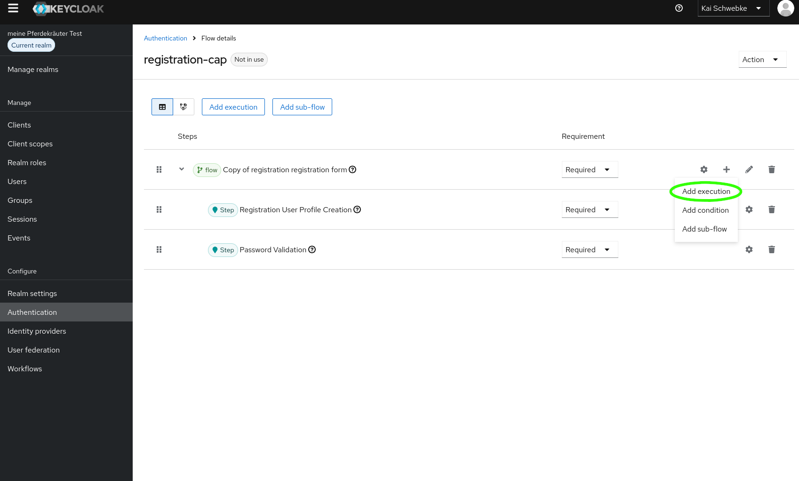
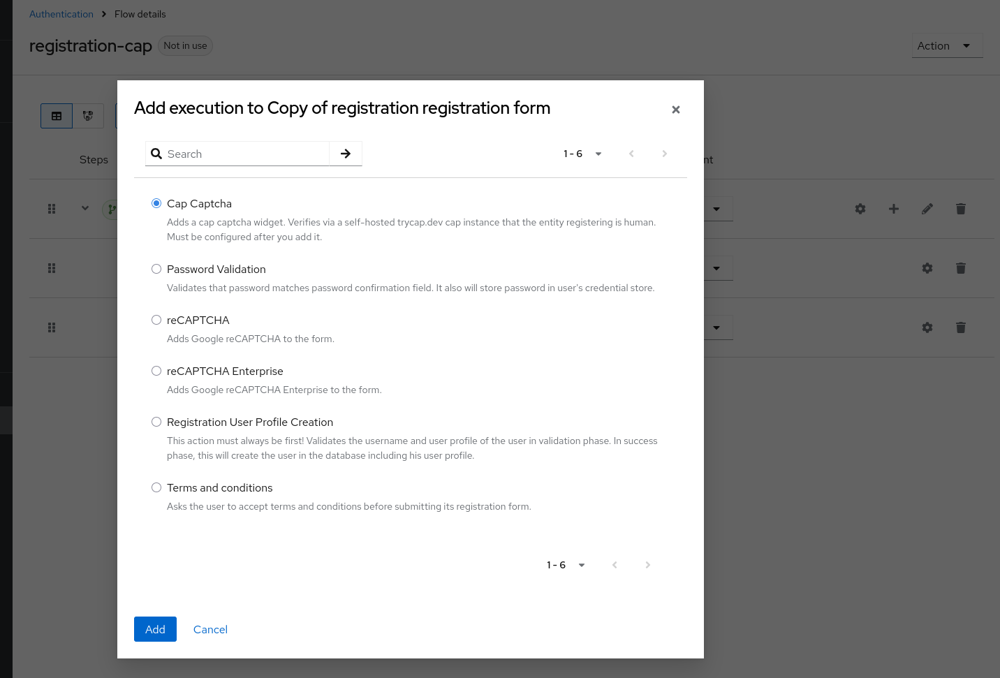
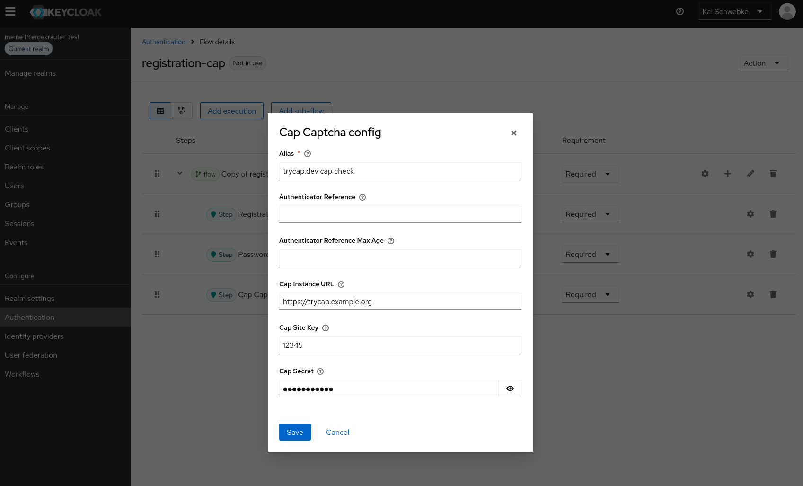
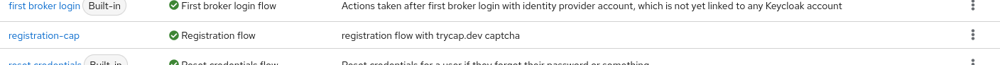

# cap-captcha-keycloak

[Keycloak](https://www.keycloak.org/) extension providing [trycap.dev cap captcha](https://trycap.dev/) validation for the registration flow.

Cap is a self-hostable proof-of-work + instrumentation CAPTCHA. This extension adapts [CaptchaFox's Keycloak extension](https://github.com/CaptchaFox/keycloak-captchafox) — specifically its registration FormAction template — to cap's API: a configurable self-hosted cap instance URL, site key, and secret, verified server-side via cap's reCAPTCHA-compatible `siteverify` endpoint. The extension is registration-only — it matches the scope of Keycloak's native reCAPTCHA (`RegistrationRecaptcha`), which ships no login-flow captcha.

For the design rationale — scope decision, cap API contract, architecture, and resolved design choices — see [`doc/design-rationale.md`](doc/design-rationale.md).

## Disclaimer

This project is not affiliated with or endorsed by the Keycloak project or the cap / trycap.dev project.

## Prerequisites

- Keycloak (repo tags record the Keycloak version we built and tested against; other versions likely work as well).
- Prebuilt jars for each tag are attached to [GitHub Releases](https://github.com/schwebke/cap-captcha-keycloak/releases); you can skip the *Build* section and jump straight to *Deploy* with the downloaded files.
- Java 17 (only if building natively instead of via Docker).
- A [cap Standalone](https://trycap.dev/guide/standalone/) instance, reachable from both the end-user's browser (for the widget) and the Keycloak server (for `siteverify`).
- From your cap dashboard: the **site key** and its **secret key** (not the dashboard `ADMIN_KEY`).

## Build

The project is a multi-module Maven build: `src/cap-captcha-spi` (the extension) and `src/cap-captcha-theme` (the sample login theme).

Docker (recommended, no local Java/Maven required):

```bash
./build.sh
```

Native (Java 17 + Maven):

```bash
mvn clean compile package
```

Both produce two jars. In the Docker image they live at image-root (`/cap-captcha-keycloak.jar`, `/cap-captcha-theme.jar`); `./build.sh` extracts them to the repo-root `target/`. A native `mvn` build leaves them in the module `target/` dirs:

| Jar | Docker | `mvn` |
|---|---|---|
| `cap-captcha-keycloak.jar` — the extension (SPI) | `/` | `src/cap-captcha-spi/target/cap-captcha-keycloak.jar` |
| `cap-captcha-theme.jar` — the sample login theme (asset-server variant; see [Theme override](#theme-override-required) and [`src/cap-captcha-theme/README.md`](src/cap-captcha-theme/README.md)) | `/` | `src/cap-captcha-theme/target/cap-captcha-theme.jar` |

The theme jar is optional — deploy it only if you want the ready-made theme.

## Deploy

1. Copy `target/cap-captcha-keycloak.jar` into Keycloak's `providers/` directory.
2. Optionally also copy `target/cap-captcha-theme.jar` into `providers/` — this registers the ready-made `cap-captcha` login theme (asset-server variant). Skip it if you are folding the cap markup into your own theme instead.
3. Restart Keycloak (or run `kc.sh build` then restart) so the provider (and, if deployed, the classpath theme) is picked up.
4. In the Keycloak admin console, one execution is now available:
   - **Cap Captcha** — a form action for the registration flow.

## Configure

The built-in `registration` flow cannot be edited directly, so you work on a copy and then bind that copy as the realm's registration flow.

### Registration flow

1. *Authentication* → *Flows* → select the built-in `registration` flow → **Action** menu (top right) → **Copy flow**. Name the copy, e.g. `registration cap`.

2. In the copy, delete the disabled **reCAPTCHA** execution — it is not needed.

3. Add the cap execution: under the copied registration form, **Add execution** → select **Cap Captcha**.

   

   

4. Set the new execution's requirement to `REQUIRED`, open its config, and set:

   | Field | Value |
   |---|---|
   | Alias | `cap-captcha` (any descriptive name; required by Keycloak) |
   | Cap Instance URL | `https://cap.example.com` (your cap instance base URL, no trailing slash) |
   | Cap Site Key | the site key from your cap dashboard |
   | Cap Secret | the secret key from your cap dashboard (not the admin key) |

   

   No `Bypass on Error` option exists — registration is always fail-closed, matching Keycloak's `RegistrationRecaptcha`.

5. Bind the copy as the realm's registration flow. The binding is done from within the copied flow's details — open it, then **Action** menu → **Bind flow** → **Registration flow**. The screenshot below shows the result back in the flows list: `registration cap` is now bound as the registration flow.

   

## Theme override (required)

The extension sets the FreeMarker attributes `${capCaptchaRequired}`, `${capCaptchaInstanceUrl}`, and `${capCaptchaSiteKey}` on the registration page. It does **not** inject the widget script. Your theme must render the widget markup and load the script.

A ready-made sample theme (self-hosted asset-server variant) lives in the `src/cap-captcha-theme` module and is built into the optional `cap-captcha-theme.jar`. It is `keycloak.v2` plus exactly the cap-relevant `register.ftl` changes and the message-bundle entries — no other customizations. See [`src/cap-captcha-theme/README.md`](src/cap-captcha-theme/README.md) for deploy / fold-into-existing-theme instructions. The snippets below are the manual-integration reference for an existing custom theme.

In your custom theme's `register.ftl`, inside the `<form>` that posts the registration back to Keycloak, add:

```html
<#if capCaptchaRequired??>
  <cap-widget
    data-cap-api-endpoint="${capCaptchaInstanceUrl}/${capCaptchaSiteKey}/"
    required></cap-widget>
</#if>
```

And load the widget script. Choose one:

### CDN (simplest)

In the theme's `<head>` or before `</body>`:

```html
<script src="https://cdn.jsdelivr.net/npm/cap-widget"></script>
```

Pin a version for production, e.g. `https://cdn.jsdelivr.net/npm/cap-widget@<version>`.

### Self-hosted asset server (cap with `ENABLE_ASSETS_SERVER=true`)

Set the WASM URL **before** the widget script loads:

```html
<script>window.CAP_CUSTOM_WASM_URL = "${capCaptchaInstanceUrl}/assets/cap_wasm_bg.wasm";</script>
<script src="${capCaptchaInstanceUrl}/assets/widget.js"></script>
```

See the [cap asset-server docs](https://trycap.dev/guide/standalone/options.html#asset-server).

The widget auto-injects `<input type="hidden" name="cap-token">` into the form on solve; no extra JS is required for the form-submit path.

## Message bundle (required)

Add these keys to your theme's `messages.properties` (and locale variants, e.g. `messages_de.properties`):

```properties
capCaptchaFailed=CAPTCHA verification failed. Please try again.
capCaptchaNotConfigured=Cap Captcha is not configured. Contact the administrator.
```

Without these entries, Keycloak renders the raw key strings on error.

## Content-Security-Policy

If your Keycloak realm enforces a strict CSP, allowlist the cap origins in `script-src`, `style-src`, `connect-src`, and `worker-src`:

- The cap instance origin (`${capCaptchaInstanceUrl}`) — always (the widget talks to it).
- `https://cdn.jsdelivr.net` — only if you use the CDN script variant.

The widget injects its own inline `<script>`/`<style>` and spawns Web Workers. Set the page nonces before the widget script:

```html
<script>
  window.CAP_SCRIPT_NONCE = "<#if scriptNonce??>${scriptNonce}</#if>";
  window.CAP_CSS_NONCE    = "<#if styleNonce??>${styleNonce}</#if>";
</script>
```

(Adjust the nonce variable names to your theme's actual nonce exports.)

## How verification works

On registration form submit, the SPI reads the `cap-token` form field and POSTs:

```
POST https://<capCaptchaInstanceUrl>/<capCaptchaSiteKey>/siteverify
Content-Type: application/json

{"secret":"<capSecret>","response":"<cap-token>"}
```

`{"success": true}` ⇒ verified; anything else ⇒ rejected. A network/timeout/parse error and a missing/blank token both fail closed — there is no bypass option, matching Keycloak's `RegistrationRecaptcha`. The verify HTTP timeout is 10s per request. See [`doc/design-rationale.md`](doc/design-rationale.md) for the fail-closed rationale and the full verify semantics.

## Credits

Thanks to Keycloak for the original reCAPTCHA implementation — the FormAction skeleton and verify semantics on which this is based — and [CaptchaFox](https://github.com/CaptchaFox/keycloak-captchafox), whose Keycloak extension provided the initial registration FormAction template and code patterns adapted here.

## License

Apache License 2.0. See [LICENSE](LICENSE).
